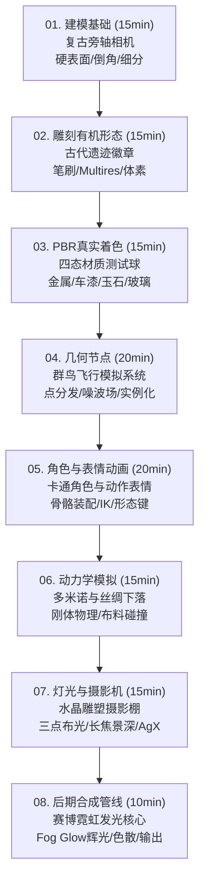

# 🎬 Blender 2小时极速通关实战教程 (2-Hour Progressive Blender Masterclass)

> **循序渐进 · 具象案例 · 纯净工程 · 开箱即用**  
> 本教程专为希望在 **2 小时内快速掌握 Blender 核心功能管线** 的学习者设计。摒弃枯燥的手册式罗列，全套课程由 **8 个高度聚焦、独立可运行、视觉出彩的实战工程案例** 组成。

---

## 🗺️ 课程时间线与案例全景图 (~120 分钟)



---

## 📂 教程模块索引与资产目录

| 序号 | 模块名称 | 具象实战案例 | 核心功能点 | 对应工程与讲义 |
| :---: | :--- | :--- | :--- | :--- |
| **01** | **多边形建模** | 复古旁轴相机 (Vintage Camera) | 顶点/边/面编辑、挤出、内插、倒角与细分修改器 | [01_modeling](tutorials/01_modeling/README.md) · [工程](tutorials/01_modeling/01_modeling.blend) |
| **02** | **雕刻有机形态** | 遗迹浮雕勋章 (Organic Relic) | 粘土条/折痕笔刷、多级精度 (Multiresolution)、对称控制 | [02_sculpting](tutorials/02_sculpting/README.md) · [工程](tutorials/02_sculpting/02_sculpting.blend) |
| **03** | **PBR 真实着色** | 材质测试球阵列 (Shader Balls) | Principled BSDF、金属度/粗糙度、透射、次表面散射 (SSS)、噪波凹凸 | [03_shading](tutorials/03_shading/README.md) · [工程](tutorials/03_shading/03_shading.blend) |
| **04** | **几何节点生成** | 飞鸟群模拟 (Bird Flock Simulation) | 点分发 (Distribute Points)、实例复制 (Instance on Points)、时间噪波流体 | [04_geometry_nodes](tutorials/04_geometry_nodes/README.md) · [工程](tutorials/04_geometry_nodes/04_geometry_nodes.blend) |
| **05** | **人物骨骼与表情** | 挥手卡通角色 (Character & Facial Rig) | 骨骼装配 (Armature)、姿态关键帧 (Pose)、面部表情形态键 (Shape Keys) | [05_character_animation](tutorials/05_character_animation/README.md) · [工程](tutorials/05_character_animation/05_character_animation.blend) |
| **06** | **物理动力学模拟** | 多米诺倒塌与丝绸垂落 (Physics Simulation) | 主动/被动刚体 (Rigid Body)、布料碰撞 (Cloth & Collision)、物理缓存 | [06_physics](tutorials/06_physics/README.md) · [工程](tutorials/06_physics/06_physics.blend) |
| **07** | **灯光与摄影机** | 暗调水晶雕塑棚拍 (Cinematic Studio) | 经典三点布光法、85mm 电影长焦景深 (DoF)、Cycles/EEVEE、AgX 色彩 | [07_lighting_rendering](tutorials/07_lighting_rendering/README.md) · [工程](tutorials/07_lighting_rendering/07_lighting_rendering.blend) |
| **08** | **后期合成与输出** | 赛博霓虹核心 (Cyber Glow Core) | 合成节点树 (Compositor)、Fog Glow 辉光、色散畸变 (Lens Distortion) | [08_compositing](tutorials/08_compositing/README.md) · [工程](tutorials/08_compositing/08_compositing.blend) |

---

## 🌟 工程纯洁性与使用规范 (Pure Scene Policy)

1. **零杂质视口**：所有 `.blend` 文件遵循工业化交付标准，场景内无冗余 3D 浮动文字或干扰注记。
2. **外部独立讲义**：全部操作步骤、设计原理、快捷键汇总及参数对照表均位于同级目录下的 `README.md` 中。
3. **零外部路径依赖**：全部材质与程序化逻辑均内嵌生成，跨平台打开 100% 免除 Missing Texture 困扰。

---

## ⚡ 极速自动化验证与一键重建

如需一键重新生成全套 8 个 `.blend` 工程并输出预览渲染图，可在终端执行：

```bash
blender --background --python scripts/generate_all_projects.py
```

渲染产物将自动保存在 `renders/` 目录下（`01_modeling.png` ~ `08_compositing.png`）。

---

## 🚀 建议学习路径
1. 从 `01_modeling` 开始，双击打开对应 `.blend` 文件，同步阅读其目录下的 `README.md`。
2. 按照每个讲义末尾的 **💡 实践步骤与练习建议** 动手修改 2~3 个核心参数。
3. 2 小时后，即可完整贯通从建模、雕刻、着色、程序化节点、绑定动画、动力学到灯光合成的现代 3D 生产管线！
