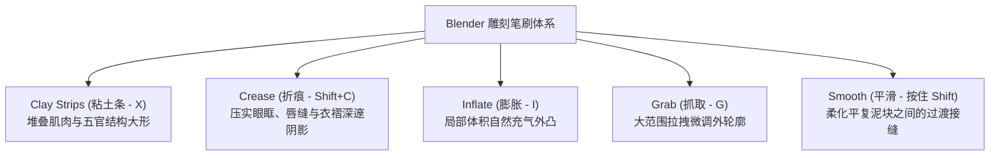

# 模块 02：有机形态与数字雕刻 (Organic Sculpting & Multiresolution)

## 📌 课程目标 (Duration: ~15 mins)
本模块引入 **Poly Haven CC0 工业级写实大理石古典雕刻半身像 (Classical Carved Marble Bust)**，让学员直观感受专业高精度有机雕刻资产的布线拓扑、解剖学结构与微表面细节。系统掌握 Blender 的 **Multiresolution (多级精度修改器)**、动态笔刷系统（粘土条 Clay Strips、折痕 Crease、膨胀 Inflate、抓取 Grab）以及 X 轴对称雕刻与法线细节烘焙准备流程。

---

## 📂 工程文件信息
- **工程路径**：`tutorials/02_sculpting/02_sculpting.blend` (打开即就绪于 **Sculpt Mode 雕刻模式**，全内嵌打包大理石 PBR 贴图)
- **主要对象结构**：
  - `Sculpt_Organic_Relic`：**核心写实雕刻半身像**（挂载 Multiresolution 修改器，开箱即可进行高频微细节雕刻）
  - `Display_Stand_Base`：摄影棚古典展台底座

---

## 🛠 核心功能与技术点拆解

### 1. 雕刻核心笔刷族谱 (Essential Sculpt Brushes)

### 2. 拓扑控制策略对比
- **Voxel Remesh (体素重构)**：
  - 快捷键 `Ctrl + R` 执行重构，`Shift + R` 调整体素网格预览大小。
  - 适用场景：概念设计草图阶段，合并多个相交网格并重新生成均匀分布的四边网格。
- **Multiresolution Modifier (多级精度修改器)**：
  - 本工程所用方案。保留最底层的简单拓扑，在上方分级雕刻（Level 1 粗胚，Level 2 中轮廓，Level 3 微细节与划痕）。
  - 优势：可随时烘焙法线贴图 (Bake Normal Map)，适合生产管线。

### 3. 对称与镜像控制 (Symmetry)
- 视口右上角支持一键开启 `X / Y / Z` 轴对称。
- 径向对称 (Radial Symmetry)：适用于制作车轮、魔法阵或徽章上的花纹结构。

---

## 📝 完整分步实战雕刻指南 (Step-by-Step Sculpting Walkthrough)

### 步骤 1：基础体块准备与多级精度细分 (Blockout & Multiresolution Setup)
1. 打开 `02_sculpting.blend`，选中居中的 `Sculpt_Organic_Relic` 勋章主体。
2. 观察修改器面板中的 **Multiresolution (多级精度修改器)**，当前已预设细分至 Level 3（多边形面数充足以表现高频微细节）。
3. 按 `Ctrl + Tab` 向上滑动进入 **Sculpt Mode (雕刻模式)**。

### 步骤 2：开启 X 轴对称与大形体堆叠 (Symmetry & Clay Strips)
1. 在视口右上角勾选 **X 轴对称 (X Symmetry)**，确保左右两侧浮雕纹理同步生成。
2. 选择 **Clay Strips (粘土条笔刷 - `X`)**，按 `F` 调整笔刷半径至中等大小。
3. 在勋章正中央沿对角线堆叠泥层，刷出浮雕的主干骨骼与隆起的兽纹/花纹大轮廓。

### 步骤 3：压实结构与刻线折痕 (Crease & Flatten)
1. 切换到 **Crease (折痕笔刷 - `Shift + C`)**。
2. 沿着刚刚堆出的泥块外边缘用力划过，刻出深邃锐利的阴影凹槽，强化浮雕的立体边界。
3. 按住 `Shift` 键轻扫表面，平滑泥块之间的突兀接缝。

### 步骤 4：体积充气与外轮廓拉拽 (Inflate & Grab)
1. 切换到 **Inflate (膨胀笔刷 - `I`)**，在勋章顶部宝石镶嵌位点轻点，让特定区域自然外凸隆起。
2. 切换到 **Grab (抓取笔刷 - `G`)**，放大笔刷半径，微调勋章的外边缘弧度，制造古老遗迹的不规则磨损感。

### 步骤 5：微细节刻画与法线烘焙准备 (Detailing & Normal Baking Workflow)
1. 将笔刷缩小（`F`），按住 `Ctrl` 使用 **Draw** 笔刷反向刻蚀细小的风化裂纹。
2. 雕刻完成后，多级精度修改器可让用户随时在低模（Level 0 用于游戏/动画渲染）与高模（Level 3 用于烘焙法线贴图）之间无缝切换。

---

## ⌨️ 常用快捷键速查表

| 操作 | 快捷键 | 功能说明 |
| :--- | :--- | :--- |
| **进入雕刻模式** | `Ctrl + Tab` -> 向上滑选 `Sculpt` | 快速模式切换饼菜单 |
| **调整笔刷半径** | `F` | 鼠标左右滑动快速缩放笔刷大小 |
| **调整笔刷强度** | `Shift + F` | 调整笔刷作用力深度 |
| **正反向雕刻** | 按住 `Ctrl` | 默认凸起变凹陷，反之亦然 |
| **平滑笔刷** | 按住 `Shift` | 随时对局部区域进行软化平滑 |
| **隐藏/遮罩** | `M` (Mask) / `Alt + M` (Clear) | 绘制遮罩保护特定区域不被雕刻变形 |

---

## 💡 实践步骤与课后练习
1. 打开 `02_sculpting.blend`，按 `Ctrl + Tab` 切换至 **Sculpt Mode**。
2. 尝试使用 **Clay Strips** 在勋章表面雕刻一组对称的翅膀或符文图案。
3. 练习使用 `Shift`（平滑）与 `Ctrl`（反向凹陷）交替操作，体验数字雕刻的流畅手感。
