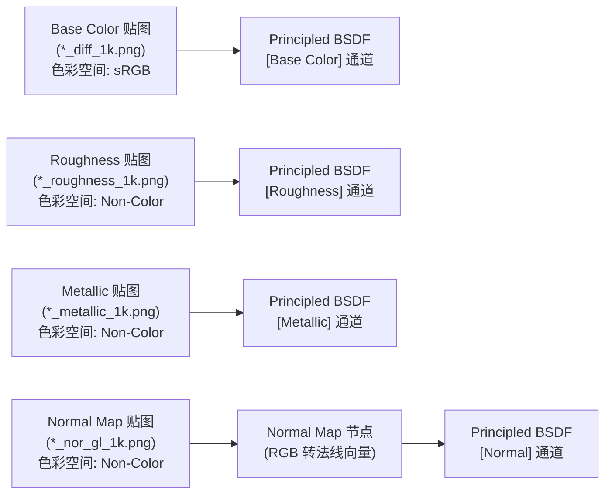

# 模块 03：真实贴图与 PBR 物理着色 (Image-Based PBR Texturing & Shading)

## 📌 课程目标 (Duration: ~20 mins)
本模块通过引入一个**工业级写实复古黄铜油灯 (Vintage Brass Lantern - Poly Haven CC0)** 配合**程序化材质测试球阵列 (Procedural Shader Balls)**，直观、清晰地讲解现代 3D 渲染工业管线中标准 **位图 PBR 贴图映射 (Image-Based PBR)**、UV 坐标传递、色彩空间规范 (Color Space) 以及程序化着色器的底层原理。

---

## 📂 工程文件信息
- **工程路径**：`tutorials/03_shading/03_shading.blend` (已全内嵌打包全部贴图，零外部路径丢失风险)
- **主要对象结构**：
  - `Lantern_01` / `Lantern_01_glass`：**核心写实 PBR 资产**（包含黄铜本体与玻璃灯罩，完整挂载 5 张 1K PBR 贴图）
  - `ShaderBall_M_Procedural_Gold`：程序化拉丝金属球（高金属度与噪波凹凸）
  - `ShaderBall_M_Procedural_Jade`：程序化玉石球（次表面透光 SSS）
  - `ShaderBall_M_Procedural_Glass`：程序化玻璃球（物理折射率 IOR 与透射）
  - `Studio_Backdrop`：摄影棚吸光深色地面

---

## 🛠 核心功能与技术点拆解

### 1. 标准图片 PBR 贴图流水线 (Image Texture Pipeline)

在真实工业管线中，一个模型通常由 4~5 张 2D 贴图通过 UV 映射驱动 Principled BSDF：

### 2. 色彩空间极其重要的黄金法则 (Color Space Rules)
这是所有 3D 初学者最容易犯错的环节：
- **sRGB**：**仅用于人眼直接看到的颜色贴图**（如 `Base Color / Diffuse / Albedo`）。
- **Non-Color (非彩色/线性数据)**：**必须用于所有数学/物理数据贴图**（如 `Roughness`, `Metallic`, `Normal Map`, `Displacement`, `Ambient Occlusion`, `Height`）。
  - *常见错误*：如果把法线贴图或粗糙度贴图设为 sRGB，会导致高光发灰、凹凸受 gamma 曲线扭曲。

### 3. 法线贴图 (Normal Map) 节点转换机制
- `Image Texture` 输出的是 RGB 颜色值（$0 \sim 1$）。
- 必须通过中间的 **Normal Map** 节点，将 RGB 转换为切线空间（Tangent Space）下的三维向量（$-1 \sim +1$），再连接到 Principled BSDF 的 `Normal` 输入端。
- 可通过 `Strength` 滑块随时增强或减弱表面的凹凸磨损感。

### 4. UV 编辑与贴图打包 (UV Unwrapping & Pack Resources)
- **UV 编辑器 (UV Editor)**：快捷键 `U` 打开展开菜单（Smart UV Project、Unwrap 等）。
- **资产打包保全**：执行 `File` -> `External Data` -> `Pack Resources`（`bpy.ops.file.pack_all()`），将所有外部图片永久固化在单个 `.blend` 文件中，彻底杜绝丢贴图导致的“材质粉色（Purple Missing Shader）”。

---

## ⌨️ 常用快捷键速查表

| 操作 | 快捷键 | 功能说明 |
| :--- | :--- | :--- |
| **切换着色预览模式** | `Z` -> 饼菜单选 `Material Preview` / `Rendered` | 快速查看视口材质渲染效果 |
| **材质着色器工作区** | 顶部标签页切换到 `Shading` | 打开材质节点编辑器与 3D 视图联动 |
| **新建节点** | `Shift + A` | 打开着色器节点添加菜单 |
| **UV 展开菜单** | 编辑模式下全选网格按 `U` | 快速执行智能 UV 投射或标记缝合边展开 |
| **快速框选整理** | `Ctrl + J` | 为选中的节点创建 Frame 边框分组 |
| **快速预览单个节点** | `Ctrl + Shift + 鼠标左键点击节点` (需开启 Node Wrangler) | 直接将该节点连接到临时输出预览 |

---

## 💡 实践步骤与课后练习
1. 打开 `03_shading.blend`，按 `Z` 选择 **Material Preview**。
2. 选中复古油灯 `Lantern_01`，进入顶部 **Shading** 工作区。
3. 观察节点图上连接的 4 张图片纹理节点，注意观察 `Roughness` 和 `Normal Map` 的 **Color Space** 是否均标记为 **Non-Color**。
4. 尝试断开 `Normal Map` 连接线，直观感受丢失微表面凹凸后的视觉扁平感，再重新连回。
5. 观察右侧的 3 个程序化测试球（黄金、玉石、玻璃），对比图片贴图与程序化节点各自的适用场景。
