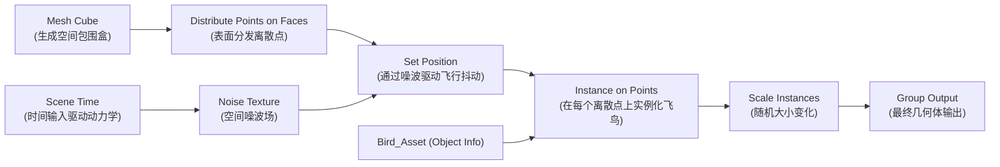

# 模块 04：几何节点与程序化生成 (Geometry Nodes - Bird Flock)

## 📌 课程目标 (Duration: ~20 mins)
本模块通过搭建一个**飞鸟群飞行模拟系统 (Bird Flock Simulation)**，带领学员深入理解 Blender 几何节点（Geometry Nodes）的场概念（Fields）、点分发（Distribute Points）、实例实例化（Instance on Points）以及时间驱动与噪波扰动算法。

---

## 📂 工程文件信息
- **工程路径**：`tutorials/04_geometry_nodes/04_geometry_nodes.blend`
- **主要对象结构**：
  - `GeometryNodes_Bird_Flock`：群鸟生成器主体，承载 `GN_Bird_Flock_System` 节点树
  - `Bird_Asset`：基础低模飞鸟模型（作为 Instance 模板被批量分发）

---

## 🛠 核心功能与技术点拆解

### 1. 几何节点核心管道流程

### 2. 核心节点功能解析
- **Distribute Points on Faces / In Volume**：将连续网格离散化为三维空间点云，通过 `Density`（密度）控制个体数量。
- **Instance on Points**：将单个模型复制到成百上千个点上，由于采用实例渲染机制（GPU Instancing），内存开销极低。
- **Scene Time + Noise Texture + Set Position**：
  - 将 `Scene Time` 的 `Seconds`（秒）输入噪波纹理的 `Scale / W` 通道。
  - 将噪波的 3D 向量连接至 `Set Position` 的 `Offset`，实现鸟群在空间中自然随风盘旋与流体状起伏。
- **Scale Instances**：为鸟群赋予自然的大小随机比例。

---

## ⌨️ 常用快捷键速查表

| 操作 | 快捷键 | 功能说明 |
| :--- | :--- | :--- |
| **几何节点工作区** | 顶部标签页切换到 `Geometry Nodes` | 打开几何节点编辑器 |
| **搜索并新建节点** | `Shift + A` -> `Search...` | 模糊搜索任何几何节点 |
| **断开节点连接** | `Ctrl + 右键拖拽划线` | 激光切断连接线 |
| **查看节点数据表** | 视口左侧打开 `Spreadsheet` 表格编辑器 | 实时检查每个顶点的属性值 (Position, Normal, ID 等) |
| **播放动画** | `Space` (空格键) | 实时播放并观察鸟群程序化动态 |

---

## 💡 实践步骤与练习建议
1. 打开 `04_geometry_nodes.blend`，按下空格键 `Space` 播放时间线。
2. 观察视口中鸟群如何在三维空间中受噪波场影响流动翱翔。
3. 尝试在节点树中添加一个 **Random Value** 节点并连接到 `Scale Instances` 的 `Scale` 输入，实现每只鸟大小各异的自然效果。
4. 调节 `Distribute Points` 的 `Density` 参数，观察鸟群数量的实时动态缩放。
