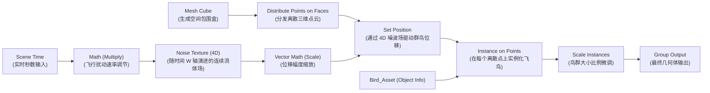

# 模块 04：几何节点与程序化流体动效 (Geometry Nodes: Procedural Swarm & Whirlpool)

## 📌 课程目标 (Duration: ~15 mins)
本模块引入 **Blender 官方开源项目几何节点经典案例 (Blender Foundation Geometry Nodes Official Demo - Procedural Cubic Whirlpool & Swarm)**，带学员剖析工业级几何节点树。掌握点分发 (Point Distribution)、点上实例化 (Instance on Points)、矢量数学 (Vector Math) 与 4D 噪波场 (Noise Field) 驱动的程序化空间旋转与规模衰减控制。

---

## 📂 工程文件信息
- **工程路径**：`tutorials/04_geometry_nodes/04_geometry_nodes.blend`
- **主要对象结构**：
  - `GeometryNodes_Bird_Flock`：**官方核心几何节点发射体**（挂载 `GN_Bird_Flock_System` 专业节点网络）
  - `Bird_Asset`：用于点上实例化的几何体资产
  - `prox_weight_location`：用于控制空间邻近距离衰减与旋转力场的动态控制空物体 (Empty)

---

## 🛠 核心功能与技术点拆解

### 1. 几何节点核心管道流程 (4D 噪波场流体飞行动画)

### 2. 核心节点功能解析
- **Distribute Points on Faces / In Volume**：将连续网格离散化为三维空间点云，通过 `Density`（密度）控制个体数量。
- **Instance on Points**：将单个模型复制到成百上千个点上，由于采用实例渲染机制（GPU Instancing），内存开销极低。
- **Scene Time + Noise Texture + Set Position**：
  - 将 `Scene Time` 的 `Seconds`（秒）输入噪波纹理的 `Scale / W` 通道。
  - 将噪波的 3D 向量连接至 `Set Position` 的 `Offset`，实现鸟群在空间中自然随风盘旋与流体状起伏。
- **Scale Instances**：为鸟群赋予自然的大小随机比例。

---

## 📝 完整分步实战构建指南 (Step-by-Step Walkthrough)

### 步骤 1：创建飞鸟实例低模 (Bird Instance Asset)
1. 按 `Shift + A` -> `Mesh` -> `Cone`（圆锥体，顶点数 6），旋转 90 度作为鸟身。
2. 新建一个扁平平面 `Plane`，横向拉长作为翅膀，与鸟身 `Ctrl + J` 合并为 `Bird_Asset`。
3. 赋予深色羽毛基础材质 `M_Bird_Feathers`，并将其移动到视口远离相机的位置作为源资产模板。

### 步骤 2：创建几何节点生成器 (Flock Generator Object)
1. 按 `Shift + A` -> `Mesh` -> `Grid`（网格面片），命名为 `GeometryNodes_Bird_Flock`。
2. 切换到顶部 **Geometry Nodes** 工作区，点击 **New (新建节点组)**，重命名为 `GN_Bird_Flock_System`。

### 步骤 3：空间离散点分发与空间包围盒 (Bounding Cube & Point Distribution)
1. 在节点编辑器中按 `Shift + A` 搜索并添加 **Cube (网格立方体)**，设置尺寸 `Size: X 14, Y 10, Z 5`，作为鸟群活动的三维空间范围。
2. 添加 **Distribute Points on Faces (在面上分发点)** 节点，连接到 Cube 的 Mesh 输出，将 `Density (密度)` 设为 `1.2`。

### 步骤 4：时间驱动与三维噪波位移场 (Scene Time + Noise Field)
1. 添加 **Scene Time (场景时间)** 节点，获取时间线实时推移的 `Seconds (秒)`。
2. 添加 **Noise Texture (噪波纹理)** 节点，将 `Scene Time -> Seconds` 连接至噪波的 `Scale`（或 4D 噪波的 `W` 轴）。
3. 添加 **Set Position (设置位置)** 节点，将噪波的 `Color` 矢量输出连接到 `Set Position -> Offset (偏移量)`。
4. 按空格键 `Space` 播放时间线，即可看到空间点云像流体/风暴一样开始优雅起伏流动！

### 步骤 5：批量实例化与随机比例 (Instance on Points & Scale)
1. 添加 **Instance on Points (在点上生成实例)** 节点，连接在 `Set Position` 之后。
2. 添加 **Object Info (物体信息)** 节点，选择 `Bird_Asset`，勾选 `As Instance`，将 `Geometry` 连接至 `Instance` 输入端。
3. 添加 **Scale Instances (缩放实例)** 节点，将整体比例设为 `0.5`，实现海量轻量化低模鸟群翱翔。

---

## ⌨️ 常用快捷键速查表

| 操作 | 快捷键 | 功能说明 |
| :--- | :--- | :--- |
| **几何节点工作区** | 顶部标签页切换到 `Geometry Nodes` | 打开几何节点编辑器 |
| **搜索并新建节点** | `Shift + A` -> `Search...` | 模糊搜索任何几何节点 |
| **断开节点连接** | `Ctrl + 右键拖拽划线` | 激光切断连接线 |
| **查看节点数据表** | 视口左侧打开 `Spreadsheet` 表格编辑器 | 实时检查每个顶点的属性值 (Position, Normal, ID 等) |
| **播放动画** | `Space` (空格键) | 实时播放并观察鸟群程序化动态 |

---

## 💡 实践步骤与课后练习
1. 打开 `04_geometry_nodes.blend`，按下空格键 `Space` 播放时间线。
2. 观察视口中鸟群如何在三维空间中受噪波场影响流动翱翔。
3. 尝试在节点树中添加一个 **Random Value** 节点并连接到 `Scale Instances` 的 `Scale` 输入，实现每只鸟大小各异的自然效果。
4. 调节 `Distribute Points` 的 `Density` 参数，观察鸟群数量的实时动态缩放。
