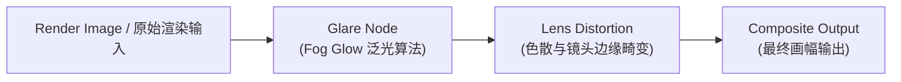

# 模块 08：后期合成与画面输出 (Compositing & Post Pipeline)

## 📌 课程目标 (Duration: ~10 mins)
本模块通过制作一个**赛博发光核心与暗色镀铬场景 (Cyber Glow Core)**，系统讲解 Blender 内置合成器 (Compositor)、辉光滤镜 (Glare / Bloom)、色调映射与调色 (Color Balance)、色散与暗角处理 (Lens Distortion / Vignette) 的后期全流程。

---

## 📂 工程文件信息
- **工程路径**：`tutorials/08_compositing/08_compositing.blend`
- **主要对象结构**：
  - `Cyber_Emission_Ring`：自发光霓虹光环（强度 8.0 纯青色 Emission 自发光材质）
  - `Core_Metallic_Cube`：悬浮金属镜面立方体（高反射与折射对比）
  - `PostProcessCompositor`：合成节点组系统（内嵌 Glare 辉光与 Lens Distortion 色散滤镜）

---

## 🛠 核心功能与技术点拆解

### 1. 合成节点流架构 (Compositing Node Flow)

### 2. 常用后期合成节点解析
- **Glare (辉光节点)**：
  - `Type`: 设为 `Fog Glow`（柔和光晕）或 `Streaks`（放射状星芒）。
  - `Threshold` (阈值)：只有亮度超过此数值的高光像素才会触发辉光溢出（避免画面整体发灰）。
  - `Quality`: `High`，`Size`: `8`。
- **Lens Distortion (镜头畸变与色散)**：
  - `Dispersion` (色差/色散)：设为 `0.01 ~ 0.02`，模拟真实光学镜头边缘轻微的三原色 RGB 分离效果。
- **Color Balance (色彩平衡)**：
  - 通过 `Lift`（阴影）、`Gamma`（中间调）、`Gain`（高光）三色轮，轻松实现电影级青橙（Teal & Orange）或暗冷调电影调色。
- **Denoise (降噪节点)**：
  - 接入 OpenImageDenoise 深度学习降噪器，消除低采样渲染的噪点。

---

## ⌨️ 常用快捷键速查表

| 操作 | 快捷键 | 功能说明 |
| :--- | :--- | :--- |
| **切换到合成工作区** | 顶部标签页选择 `Compositing` | 打开合成器节点视图 |
| **渲染并自动应用合成** | `F12` | 执行渲染并触发合成节点流水线 |
| **重置背景视图大小** | `Alt + V` (缩小) / `V` (放大) | 缩放合成器背板的预览图像 |
| **移动合成背景预览** | `Alt + 鼠标中键拖拽` | 平移背板图像位置 |

---

## 💡 实践步骤与练习建议
1. 打开 `08_compositing.blend`，按 `F12` 渲染当前帧。
2. 观察最终渲染图上，霓虹光环所产生的电影级柔和辉光（Fog Glow）以及画面四周微微的色散边缘（Chromatic Aberration）。
3. 尝试在 Compositing 工作区中修改 `Glare` 节点的 `Threshold`（如从 1.2 改为 0.5），观察发光区域范围的变化。
