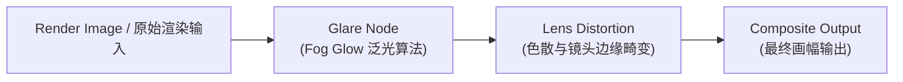

# 模块 08：后期合成与画面输出 (Compositing & Post Pipeline)

## 📌 课程目标 (Duration: ~10 mins)
本模块通过制作一个**赛博发光核心与暗色镀铬场景 (Cyber Glow Core)**，系统讲解 Blender 内置合成器 (Compositor)、辉光滤镜 (Glare / Bloom)、色调映射与调色 (Color Balance)、色散与暗角处理 (Lens Distortion / Vignette) 的后期全流程。

---

## 📂 工程文件信息
- **工程路径**：`tutorials/08_compositing/08_compositing.blend`
- **主要对象结构**：
  - `Cyber_Emission_Ring`：自发光霓虹光环（强度 8.0 纯青色 Emission 自发光材质）
  - `Core_Metallic_Cube`：悬浮金属镜面立方体（高反射与折射对比）
  - `PostProcessCompositor`：合成节点组系统（内嵌 Glare 辉光与 Lens Distortion 色散滤镜）

---

## 🛠 核心功能与技术点拆解

### 1. 合成节点流架构 (Compositing Node Flow)

### 2. 常用后期合成节点解析
- **Glare (辉光节点)**：
  - `Type`: 设为 `Fog Glow`（柔和光晕）或 `Streaks`（放射状星芒）。
  - `Threshold` (阈值)：只有亮度超过此数值的高光像素才会触发辉光溢出（避免画面整体发灰）。
  - `Quality`: `High`，`Size`: `8`。
- **Lens Distortion (镜头畸变与色散)**：
  - `Dispersion` (色差/色散)：设为 `0.01 ~ 0.02`，模拟真实光学镜头边缘轻微的三原色 RGB 分离效果。
- **Color Balance (色彩平衡)**：
  - 通过 `Lift`（阴影）、`Gamma`（中间调）、`Gain`（高光）三色轮，轻松实现电影级青橙（Teal & Orange）或暗冷调电影调色。
- **Denoise (降噪节点)**：
  - 接入 OpenImageDenoise 深度学习降噪器，消除低采样渲染的噪点。

---

## 📝 完整分步实战构建指南 (Step-by-Step Compositing Walkthrough)

### 步骤 1：创建赛博自发光核心与暗铬金属 (Cyber Core & Emission Material)
1. 打开 `08_compositing.blend`，正中央为赛博发光圆环 `Cyber_Emission_Ring`，内嵌多角度倾斜的暗铬金属立方体 `Core_Metallic_Cube`。
2. 为圆环赋予自发光材质 `M_Emission_Neon_Cyan`，自发光强度（Emission Strength）设为高达 `8.0`（高能量发光体是触发后期眩光与辉光溢出的关键）。

### 步骤 2：开启合成工作区与节点树 (Compositor Workspace & Node Tree)
1. 切换到顶部 **Compositing (合成)** 工作区。
2. 勾选顶部的 **Use Nodes (使用节点)**。
3. 默认可见 `Render Layers (渲染层输入)` 节点连接至 `Composite (最终合成输出)` 节点。

### 步骤 3：添加辉光节点 (Glare - Fog Glow)
1. 在两个节点中间按 `Shift + A` -> `Filter` -> `Glare (辉光)`，放置在线路上。
2. 将模式从默认的 `Streaks` 切换为 **Fog Glow (雾状辉光/柔光)**：
   - **Quality (品质)**：设为 `High`。
   - **Threshold (阈值)**：设为 `1.2`（确保只有亮度超过 1.2 的发光环产生辉光，暗部背景保持纯黑深邃）。
   - **Mix (混合度)**：设为 `0.0`（$0.0$ 表示原图与辉光等比混合）。

### 步骤 4：添加镜头色散与畸变 (Lens Distortion & Chromatic Aberration)
1. 按 `Shift + A` -> `Distort` -> `Lens Distortion (镜头畸变)`，连接在 Glare 节点之后。
2. 将 **Dispersion (色散/色差)** 设为 `0.02`：
   - 模拟真实电影摄影机镜头边缘的红绿蓝 RGB 光谱轻微拆分，立刻为三维渲染注入极富呼吸感的胶片光学质感！
3. 勾选 **Fit (适配)**，防止边缘畸变产生黑边。

### 步骤 5：实时背景预览与最终离线合成输出 (Viewer Node & Master Render)
1. 按 `Shift + A` -> `Output` -> `Viewer (查看器)`，将 Lens Distortion 的图像输出同时连接到 Viewer 节点。
2. 开启视口右上角 **Backdrop (背景预览)**，按 `V` / `Alt + V` 即可在合成节点编辑器背景缩放查看全分辨率合成效果。
3. 按 `F12` 渲染整幅图像，渲染完成后 Blender 会自动在毫秒级时间内执行整套后期节点链，直接输出最终院线级 CG 大片！

---

## ⌨️ 常用快捷键速查表

| 操作 | 快捷键 | 功能说明 |
| :--- | :--- | :--- |
| **开启合成节点编辑器** | 顶部标签页切换到 `Compositing` | 进入后期合成工作区 |
| **快速预览当前节点** | `Ctrl + Shift + 鼠标左键点击节点` (需开启 Node Wrangler) | 一键连接到 Viewer 节点在背景预览效果 |
| **缩放背景预览图** | `V` (缩小) / `Alt + V` (放大) | 缩放合成背景 Backdrop 视图 |
| **移动背景预览图** | `Alt + 鼠标中键拖拽` | 平移背景预览图像位置 |
| **静帧渲染与合成** | `F12` | 渲染图像并自动执行后期合成管道 |
| **保存合成后图像** | 渲染窗口中按 `Alt + S` | 导出最终带有辉光与色散的 PNG/EXR 文件 |

---

## 💡 实践步骤与课后练习
1. 打开 `08_compositing.blend`，按 `F12` 进行单帧渲染。
2. 观察渲染完成后，图像中心的高亮圆环瞬间绽放出柔和的青色 Fog Glow 雾光，画面边缘呈现微弱的镜头 RGB 色散。
3. 尝试在 Glare 节点中将 `Type` 切换为 `Streaks`（星芒耀斑），调整 `Streaks: 4` 或 `6`，观察科幻电影般的十字星芒高光！
4. 尝试在合成流中加入一个 **Color Balance (色彩平衡)** 节点，调整 Lift/Gamma/Gain 色轮，为全场景调出经典的冷暖电影色调。
